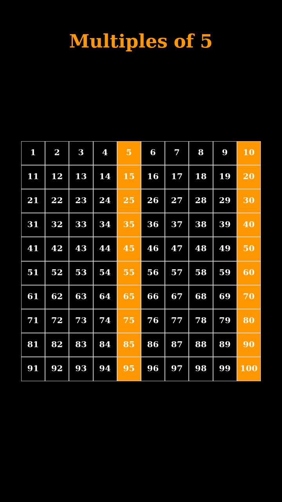

# Number Types

A mathematical visualization project for classifying notable integers from 1 to 100. It combines a reusable, dependency-free Python library with documented notebooks and vertical animations for lectures, short-form video, and mathematical outreach.



## Repository structure

| Path | Purpose |
|---|---|
| `src/number_types/` | Tested predicates, integer sequences, and the 34-category catalog |
| `notebooks/number_categories.ipynb` | Canonical tutorial and visualization workflow |
| `notebooks/legacy/` | Preserved historical notebook versions |
| `tests/` | Mathematical regression and boundary tests |
| `output/` | Existing MP4, GIF, and preview artifacts |
| `REFERENCES.md` | Canonical books, OEIS records, and software documentation |

## Mathematical scope

The catalog contains 34 classes: parity and divisibility classes; primes, composites, semiprimes, and sphenic numbers; square, cube, perfect-power, polygonal, and pyramidal numbers; perfect, abundant, and deficient numbers; Fibonacci, Catalan, and Pell sequences; and several digit- or representation-dependent classes.

Definitions are explicit about conventions. In particular, semiprime factor multiplicity is counted, the project uses the standard base-ten Kaprekar split, and sequence catalogs contain positive values only.

## Installation and checks

```bash
git clone https://github.com/ozsp12/number_types.git
cd number_types
python -m pip install -e ".[visualization,notebook,dev]"
python -m unittest discover -s tests -v
```

## Usage

```python
from number_types import build_categories, is_prime

is_prime(97)
# True

categories = build_categories(100)
prime_numbers = next(item.values for item in categories if item.title == "Prime Numbers")
len(prime_numbers)
# 25
```

To reproduce the canonical notebook:

```bash
python -m jupyter nbconvert --execute --to notebook --inplace notebooks/number_categories.ipynb
```

MP4 export additionally requires FFmpeg on the system path. The classification library itself has no third-party dependencies.

## Documentation

See [REFERENCES.md](REFERENCES.md) for mathematical and software sources and [CONTRIBUTING.md](CONTRIBUTING.md) for implementation standards.

## Author

**Dr. Osvaldo L. Santos-Pereira** — [Academic webpage](https://ozsp12.github.io/) · [Lattes](http://lattes.cnpq.br/6730251976463283) · [ORCID](https://orcid.org/0000-0003-2231-517X) · [Google Scholar](https://scholar.google.com/citations?user=HIZp0X8AAAAJ&hl=en) · [ResearchGate](https://www.researchgate.net/profile/Osvaldo-Santos-Pereira) · [GitHub](https://github.com/ozsp12) · [LinkedIn](https://www.linkedin.com/in/ozsp12) · [Substack](https://substack.com/@olsp1982) · [Medium](https://medium.com/@ozsp12) · [YouTube](https://www.youtube.com/@ozlsp12) · [X](https://x.com/ozsp12)
